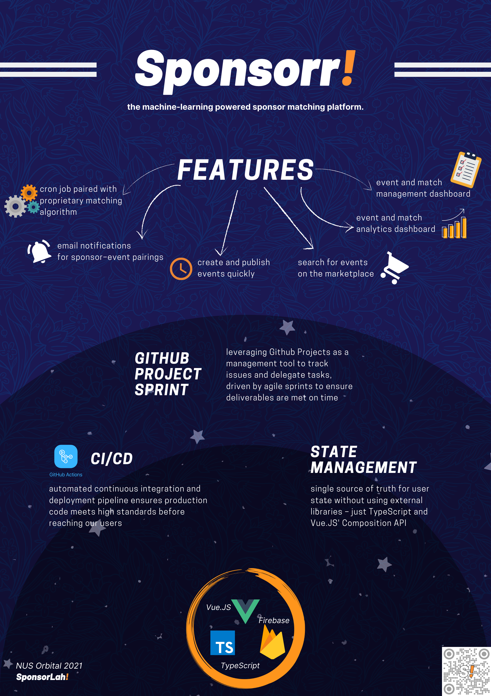

# **Sponsorr!** ([NUS CP2106 Orbital](https://orbital.comp.nus.edu.sg/) 2021 Cohort)



## Description

Sponsorr! is a machine-learning powered platform that matches event organisers with sponsors.
It aims to streamline the process of sourcing for sponsorships, so event organisers can focus on planning a better
event, and sponsors can find wider avenues to promote their brand, service, or product to a focused target audience.
The platfrom enables event organisers and partners to come together for event partnership and sponsorship. With a
few clicks, you can pitch your event or sponsorship proposals on the marketplace, and let our matching algorithm pair
it with credible and reputable users, tailored to your specifications. The agreement signing experience can be
expedited, leading to a streamlined agreement process.

## Development Journey

### Summary
* Read our final project documentation including motivation, ideation process, system design, and learning outcomes [here](https://github.com/clement0010/sponsorr-frontend/blob/master/docs/Project%20Documentation.pdf).
* Check out our final product demo video [here](https://youtu.be/RFZNq46aWIo).
* Check out our product backend code [here](https://github.com/clement0010/sponsorr-backend).

### Breakdown
Feel free to take a look at how this project has evolved, from ideation to deployment:

- [Project Pitch](https://www.youtube.com/watch?v=SfNs5uEmZWA)
  - [Proposal](https://docs.google.com/document/d/1mbA4ZHtav04lupBUXg4RgyoPpDLDZz0KTOKKjeSH_9Y/edit?usp=sharing)
  - [Pitch Deck](https://docs.google.com/presentation/d/150ZKsGdQkDnQZBnfJGwSMTkpkqoAbQtl20hql-c7JcI/edit?usp=sharing)
  - [Poster](https://drive.google.com/file/d/1vV17jFlLaF7RA1v_sc-l41ZA-ulAqoqg/view?usp=sharing)
- [Milestone 1](https://youtu.be/H92cef2NKTM)
  - [Poster](https://drive.google.com/file/d/1vV17jFlLaF7RA1v_sc-l41ZA-ulAqoqg/view?usp=sharing)
  - [Milestone Write-Up](https://docs.google.com/document/d/1JqZ7Cm6PT4Ue3Pp8MInbX7ZBfVo4QG0MUFLlWEe0BMY/edit?usp=sharing)
- [Milestone 2](https://youtu.be/oykdRGuRCWc)
  - [Poster](https://drive.google.com/file/d/1K6ScFJ7BJZGxIZxjk68ucgtjjUfKgRlz/view?usp=sharing)
  - [Milestone Write-Up](https://docs.google.com/document/d/131qKWSzBtd6k6FKx0j7ba00xOObokmXpWZoDdxMejds/edit?usp=sharing)
- [Milestone 3](https://youtu.be/ZP39scTpQZU)
  - [Poster](https://drive.google.com/file/d/1OqoW7TIMExZxmI2FvSwKM03c2cxeWEFm/view?usp=sharing)
  - [Milestone Write-Up](https://docs.google.com/document/d/1_B_ycWxfpLzwsx6AfZ8hdVLBZSDEgd_bBzLRNggkgmg/edit?usp=sharing)

# Project setup

```
npm install
```

### Compiles and hot-reloads for development

```
npm run serve
```

### Compiles and minifies for production

```
npm run build
```

### Lints and fixes files

```
npm run lint
```

### Customize configuration

See [Configuration Reference](https://cli.vuejs.org/config/).

# Version Control and Collaboration (Github)

Run this in bash/terminal before running anything important:

```
git status
```

## Working with master branch

### Before Starting

```
git pull --rebase
```

### Pushing Changes

```
git add [filename]
```

```
git commit -m "[Commit message]"
```

```
git status
```

```
git push
```

## Working With Other Branches

### Creating New Branch

```
git checkout -b feature/[name of feature]
```

### Moving Between Branches

```
git checkout [name of branch]
```

## SOP After Making Changes

**Important**: Create new Pull Request. Once all conflicts and issues have been resolved, proceed to merge.

### Alternative Merge Method

In your master branch:

```
git pull --rebase
```

In your development branch:

```
git merge master
```

In your master branch:

```
git merge branch
```

**Note:** Only do this when you are absolutely sure that there will be no merge conflicts. Otherwise always do a pull request. This is for convenience and to prevent confusion.

### Resolving Merge Conflicts

1. Notify all parties affected
2. Resolve conflict together using Github's online **Web Editor**
3. Delete redundant files. This is also an effective way to resolve merge conflicts

## Deleting Branch After Merge

Three choices for deleting development branches:

### Delete via Pull Request

When confirming merge to master using pull requests, select the option to delete branch

### Delete via Terminal

to delete remote branch:

```
git push origin --delete development
```

to delete local branch:

```
git branch -d development
```

# Development Workflow

1. File an issue (see Project board)

2. Open a new branch and work on the issue (follow branch naming and commit message conventions)

3. Pull request and code review

4. Merge and close issue
